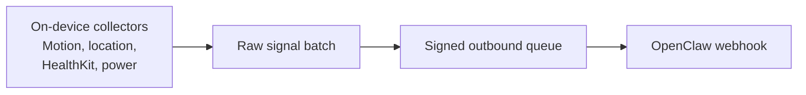

# SenseKit

[](https://github.com/Sense-Kit/sense-kit/actions/workflows/ci.yml)

SenseKit is an open-source iPhone context runtime for AI agents.

It listens to passive on-device signals like motion, location, workouts, and power state, packages those observations as raw signal batches, and delivers signed HTTPS payloads to OpenClaw.

The project exists to solve one practical problem: an agent cannot act intelligently around the real world if the user has to build a pile of Shortcuts automations before anything works. SenseKit aims to be useful right after install and permission approval.

## Why SenseKit

- `Passive-first`: useful events should be possible without manual Shortcuts setup.
- `Agent-first`: the phone ships observations and the agent decides what they mean.
- `Raw-by-default`: the outbound payload is a signal batch, not a pre-chewed event plus summary snapshot.
- `Signed delivery`: every outbound payload is HMAC-signed before it leaves the phone.
- `OpenClaw-first`: the primary integration path is signed outbound delivery, not hosting a server on the phone.

## Current status

SenseKit is early, opinionated, and real.

What already exists in this repository:

- a Swift runtime package with Motion, Location, HealthKit, and power collectors
- raw-signal queueing, signed webhook delivery, and audit logging
- a SwiftUI app shell with onboarding, settings, audit log, and debug timeline scaffolding
- a separate bench harness target for field testing
- shared JSON schemas and TypeScript validation helpers

What is still being validated on real devices:

- wake detection precision
- driving detection precision
- battery impact over normal daily use
- background wake and delivery reliability
- final onboarding polish

If you are evaluating the project, start with:

- [SPEC.md](SPEC.md)
- [docs/README.md](docs/README.md)
- [docs/bench/phase-1a-field-test.md](docs/bench/phase-1a-field-test.md)
- [docs/runbooks/runtime-bootstrap.md](docs/runbooks/runtime-bootstrap.md)

## Architecture at a glance



SenseKit is now intentionally closer to a data transport runtime than an event engine. The phone captures raw collector observations, keeps local audit/debug traces, and sends signed signal batches so the agent can do the interpretation.

## What leaves the phone

| Sent to OpenClaw | Stays local by default |
| --- | --- |
| Raw signal batches such as `motion.activity_observed`, `location.region_state_changed`, or `health.workout_sample_observed` | Calendar titles and attendees |
| Signal payload fields like motion flags, speed, battery state, workout metadata, and optional coordinates | Local debug traces |
| Signal timestamps and collector/source metadata | Local audit history |
| The configured bearer token in the HTTP `Authorization` header and a derived HMAC signature header | The raw HMAC secret itself |

In the current bench app, place coordinates are still gated by the existing place sharing setting. The HMAC secret itself does not leave the phone, but the configured bearer token does because it is used to authenticate the outbound request to the user's chosen endpoint. During place setup, address search can also use Apple MapKit and geocoding services.

## Repository guide

- [`apps/ios`](apps/ios): the iPhone app, bench harness, runtime package, and SwiftUI package
- [`packages/contracts`](packages/contracts): JSON schemas, fixtures, and TypeScript validation helpers
- [`packages/openclaw-skill`](packages/openclaw-skill): example skill packaging for OpenClaw
- [`packages/openclaw-plugin`](packages/openclaw-plugin): plugin surface for later OpenClaw integration work
- [`packages/examples`](packages/examples): QR bootstrap and hook configuration examples
- [`docs`](docs): ADRs, privacy notes, release notes, runbooks, and field-test plans

Documentation entry points:

- [docs/README.md](docs/README.md)
- [CHANGELOG.md](CHANGELOG.md)
- [CONTRIBUTING.md](CONTRIBUTING.md)
- [SECURITY.md](SECURITY.md)
- [SUPPORT.md](SUPPORT.md)

## Local setup

Requirements:

- Xcode with `iOS 17+` SDK support
- Node.js and `pnpm`
- Ruby only if you want to regenerate the Xcode project with `scripts/generate_ios_project.rb`

Install JavaScript dependencies:

```bash
pnpm install
```

Run the TypeScript workspace checks:

```bash
pnpm build
pnpm test
pnpm contracts:check
```

Run Swift package tests:

```bash
cd apps/ios/Packages/SenseKitRuntime && swift test
cd apps/ios/Packages/SenseKitUI && swift test
```

Build the iOS app targets:

```bash
xcodebuild -workspace apps/ios/SenseKit.xcworkspace -scheme SenseKitApp -sdk iphonesimulator -destination 'generic/platform=iOS Simulator' CODE_SIGNING_ALLOWED=NO build
xcodebuild -workspace apps/ios/SenseKit.xcworkspace -scheme SenseKitBenchApp -sdk iphonesimulator -destination 'generic/platform=iOS Simulator' CODE_SIGNING_ALLOWED=NO build
```

## OpenClaw connectivity

For personal testing, keep OpenClaw private and use Tailscale instead of exposing the raw Gateway to the public internet.

- Keep OpenClaw on `gateway.bind: "loopback"` and expose it privately with Tailscale Serve.
- Use a separate `hooks.token` for SenseKit hooks. Do not reuse `gateway.auth.token`.
- Treat hook payloads as untrusted content even when they come from systems you control.
- If OpenClaw returns `hook mapping failed`, remove any custom `transform` block first and test with the example mapping unchanged.

## Contribution focus

The highest-value work for the current milestone is:

1. passive wake validation on real devices
2. driving detection validation on real commutes
3. background wake and delivery reliability
4. onboarding and debug timeline polish

Contributions are welcome. If your change affects architecture, add or update an ADR in [`docs/adr`](docs/adr).

## Project standards

- License: Apache-2.0
- Contribution guide: [CONTRIBUTING.md](CONTRIBUTING.md)
- Code of conduct: [CODE_OF_CONDUCT.md](CODE_OF_CONDUCT.md)
- Security policy: [SECURITY.md](SECURITY.md)
- Support guide: [SUPPORT.md](SUPPORT.md)
